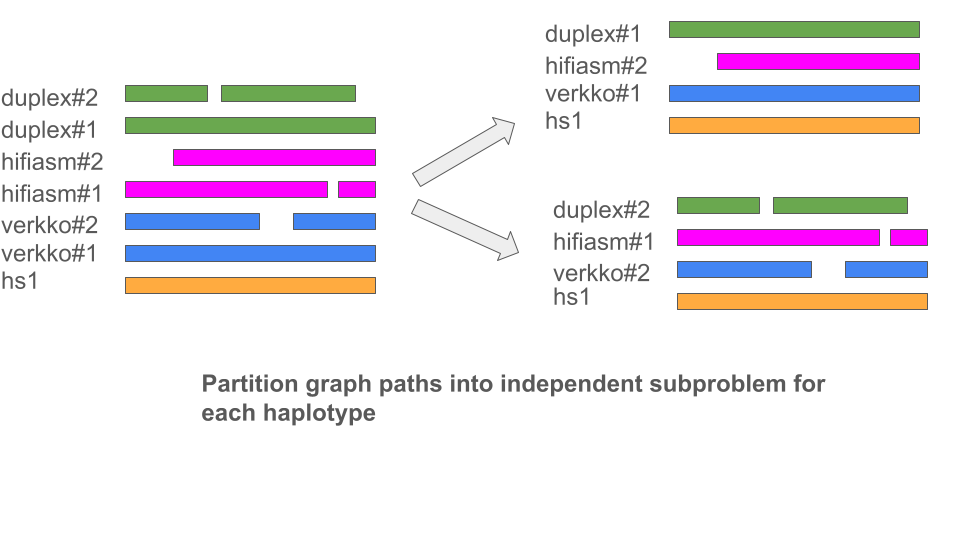
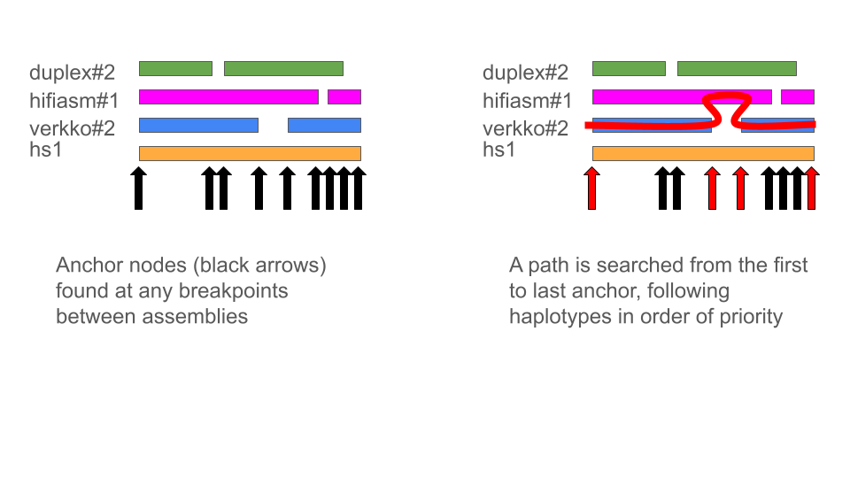

# panpatch

Use a pangenome graph to patch (slightly) fragmented assemblies into T2T chromosomes

## Input Pangenome Alignment

The input to `panpatch` is a chromosome graph in `.vg` format that includes a (single) reference (ideally CHM13) contig. The alignment should include both the assembly you want to patch (ex verkko) and additional assemblies to use for patching (ex ont, hifiasm). 

This alignment could be made with [minigraph-cactus](https://github.com/ComparativeGenomicsToolkit/cactus/blob/master/doc/pangenome.md).  An example input file, `pan28.hs1.seqfile`, is

```
hs1              https://hgdownload.soe.ucsc.edu/goldenPath/hs1/bigZips/hs1.fa.gz
PAN028-verkko.1  PAN028.haplotype1.full.verkko2.fa
PAN028-verkko.2  PAN028.haplotype2.full.verkko2.fa
PAN028-hifiasm.1 PAN028.hifiasm.20240417.hic.hap1.fa
PAN028-hifiasm.2 PAN028.hifiasm.20240417.hic.hap2.fa
PAN028-duplex.1  PAN028.haplotype1.duplex.verkko2.0.fa
PAN028-duplex.2  PAN028.haplotype2.duplex.verkko2.0.scaff.fa

```

(note the `.1/.2` suffixes in the first column denote haplotype and are [important](https://github.com/ComparativeGenomicsToolkit/cactus/blob/master/doc/pangenome.md#sample-names))

The alignment is then done with

```
cactus-pangenome ./js ./pan028.hs1.seqfile --outName pan028-mc-hs1 --outDir pan028-mc-hs1 --logFile pan028-mc-hs1.log --batchSystem slurm --gbz --reference hs1 --consCores 65 --mgCores 64 --indexCores 64 --mapCores 16 --xg full --chrom-vg full
```

And the `.vg` files that can be used to patch each chromosome will be found in `pan028-mc-hs1/pan028-mc-hs1.chroms`

## PanPatch

This is a work in progress towards a proof of concept....

### Building Panpatch

Clone it with submodules then `make`.  The `panpatch` binary should be built in the same directory if all went well.

```
git clone --recursive https://github.com/glennhickey/panpatch.git --branch development
cd panpatch
make
```

If you are missing system dependencies, you can try following the [Install Dependencies](https://github.com/vgteam/vg?tab=readme-ov-file#linux-install-dependencies) section from vg -- `panpatch` uses a subset of these so they will be more than sufficient. 

### Interface

You specify the graph and sample names in order of priority (first column of the above input file, excluding `.1/2` suffixes)
```
panpatch <graph.vg> -r <reference sample> -s <sample to patch> -s <first sample to patch with> -s <second sample> etc.
```

For example

```
panpatch chr20.full.vg -r hs1 -s PAN028-verkko -s PAN028-hifiasm -s PAN028-duplex
```

will patch the `PAN028-verkko` assembly, using `PAN028-hifiasm` where possible, then `PAN028-duplex` as a backup.

The output will be a list of contig intervals (BED format), for each haplotype, that span the reference chromosome from telomere to telomere, which form the patched T2T assembly.

You can write a FASTA file for the patched contigs with `--fasta FILE`. 

Note: small intervals should probably be filtered out, there's not such logic yet in `panpatch`.  The output of the above is

```
Patched assembly for PAN028-verkko#1:
PAN028-hifiasm#2#h2tg000032l#0	2	27
PAN028-verkko#1#haplotype1-0000008#0	0	64821530
PAN028-verkko#1#haplotype1-0000043#0	11	673283
PAN028-hifiasm#2#h2tg000052l#0	649569	683780
PAN028-verkko#1#haplotype1-0000046#0	0	682357

Patched assembly for PAN028-verkko#2:
PAN028-verkko#2#haplotype2-0000073#0	1	65910828
```
### Running time

The above example takes about 2 hours on the cluster to run `cactus-pangenome`.  Running `panpatch` on each chromsome in series takes about 2 minutes total on my desktop. 

### Algorithm

All contigs are first binned by haplotype.  Since input not necessarily trio-phased, this determines whether, for example, haplotype 1 from verkko corresponds to haplotype 1 or haplotype 2 from hifasm, etc.

This is accomplished by looking at the average alignment identity in the graph between pairs of haplotypes, over windows of `1000bp`.



Next, the reference path of the chromosome (ie CHM13) is scanned left to right for potential anchors.  An anchor is a node in on the reference path that where one more paths either starts, ends or branches off from another.

Finally a path through the anchors is searched in the graph that connects the first and last anchors (tips of the reference path), giving a T2T assembly of the contig (if possible).  The path stays on the highest priority path at every junction (verkko, then hifiasm, then duplex in our example). 



### Limitations and future work

* Just a proof of concept, tuning certainly required to avoid spurious patches etc.
* Not well-tested (see above)
* Entirely reference-based.  If graph doesn't align contigs to reference, then no anchors will be found.  This could happen in acrocentric short arms, for example.
* Telomere-checker, which would be informative, isn't quite finished. 


