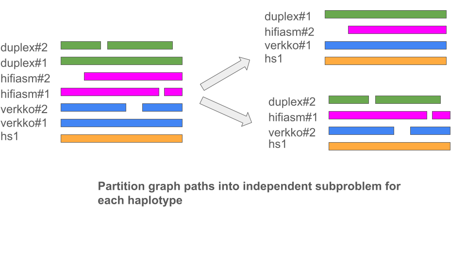
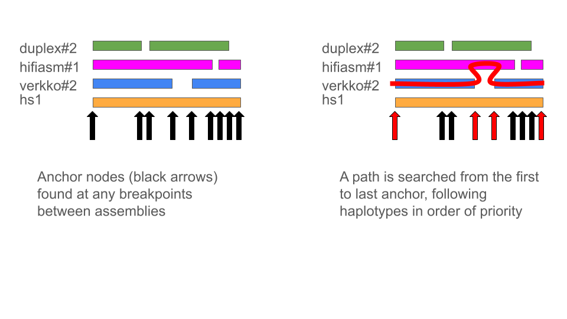

# panpatch

Use a pangenome graph to patch (slightly) fragmented assemblies into telomere-to-telomere (T2T) chromosomes. panpatch fills gaps (`N`s) inside scaffolds, scaffolds disconnected contigs, and completes missing terminal telomeres, taking the patch sequence from one or more donor assemblies. All of that is on by default; `--patch-types` selects a subset and `-T` additionally requires a telomere at both ends.

It needs a **reference** with chromosome-scale scaffolds for orientation (`-r`), a **target** to patch (first `-s`), and one or more **donors** in priority order (subsequent `-s`). A chromosome-scale target can be its own reference.

> [!IMPORTANT]
> **The recommended way to run panpatch is [`cactus-panpatch`](https://github.com/ComparativeGenomicsToolkit/cactus/blob/master/doc/pangenome.md#patching-assemblies-cactus-panpatch)**, now included in [Cactus](https://github.com/ComparativeGenomicsToolkit/cactus). It is a higher-level interface that builds the pangenome graph and runs panpatch for you in a single command — much simpler than the manual workflow below.

## Quick start

**1. Build a pangenome graph** of your assemblies with [Minigraph-Cactus](https://github.com/ComparativeGenomicsToolkit/cactus/blob/master/doc/pangenome.md). The `--reference` and `--chrom-vg full` options are required. List the assemblies in a seqfile (the `.1`/`.2` suffix sets the [haplotype](https://github.com/ComparativeGenomicsToolkit/cactus/blob/master/doc/pangenome.md#sample-names)):

```
hs1               https://hgdownload.soe.ucsc.edu/goldenPath/hs1/bigZips/hs1.fa.gz
PAN028-verkko.1   PAN028.hap1.verkko.fa
PAN028-verkko.2   PAN028.hap2.verkko.fa
PAN028-hifiasm.1  PAN028.hifiasm.hap1.fa
PAN028-hifiasm.2  PAN028.hifiasm.hap2.fa
```
```
cactus-pangenome ./js seqfile.txt --reference hs1 --chrom-vg full --outName mc --outDir mc   # + cluster options
```

**2. Run panpatch** over all the chromosome graphs in one command:
```
cd mc/mc.chroms
panpatch *.full.vg -r hs1 -s PAN028-verkko -s PAN028-hifiasm --bed patched.bed -f patched.fa > patched.report
```

This patches `PAN028-verkko`, using `PAN028-hifiasm` (and any later `-s` as backups), and writes three independent outputs:

- **`patched.report`** (stdout) — a TSV, one row per candidate patch (see [The report](#the-report));
- **`patched.bed`** — the patched-assembly intervals;
- **`patched.hap1.fa` / `patched.hap2.fa`** — one FASTA per haplotype.

A chromosome that can't be patched keeps its input contig(s). The BED and FASTAs are written only after every graph succeeds, so a failure never leaves partial output. Add `-p` for progress on stderr.

You can pass one graph or many (`panpatch chr*.full.vg ...`); they are processed in order and concatenated, and a graph with no single reference path (e.g. a `chrOther` bin of unplaced contigs) is passed through unchanged.

## Reference-free patching

panpatch can run with **no external reference** by using the target haplotype as its own reference — the donor then aligns directly to the target instead of through a third genome. Minigraph-Cactus references must be haploid, so build **one graph per haplotype** and pass that haplotype as both `-r` and the first `-s`. For `PAN028-verkko` haplotype 1, the seqfile drops the external reference and the other haplotype:

```
PAN028-verkko_1   PAN028.hap1.verkko.fa
PAN028-hifiasm.1  PAN028.hifiasm.hap1.fa
PAN028-hifiasm.2  PAN028.hifiasm.hap2.fa
```
```
cactus-pangenome ./js seqfile.txt --reference PAN028-verkko_1 --chrom-vg full --outName mc1 --outDir mc1
panpatch mc1/mc1.chroms/*.full.vg -r PAN028-verkko_1 -s PAN028-verkko_1 -s PAN028-hifiasm \
    --bed patched.hap1.bed -f patched.hap1.fa > patched.hap1.report
```

Repeat with `_2` for haplotype 2. Here the graph's "chromosomes" are the assembly's own contigs, so panpatch fills gaps and completes telomeres within each contig but cannot scaffold across them.

## Building

```
git clone --recursive https://github.com/glennhickey/panpatch.git
cd panpatch && make
```

Missing system libraries are a subset of [vg's](https://github.com/vgteam/vg?tab=readme-ov-file#linux-install-dependencies). Prebuilt Linux binaries are on the [releases](https://github.com/glennhickey/panpatch/releases) page.

## Options

| option | description | default |
|---|---|---|
| `-r, --reference STR` | reference sample (required) | |
| `-s, --sample STR` | target to patch (first), then donors in priority order (required, repeatable) | |
| `-f, --fasta FILE` | write the patched assembly, one FASTA per haplotype (`FILE.hap1.fa`, ...) | |
| `--bed FILE` | write the patched-assembly intervals (BED) | |
| `-e, --default-sample STR` | use this sample's contig when a patch is rejected | |
| `-b, --exclude-bed FILE` | target regions to leave untouched (see [Excluding regions](#excluding-regions)) | |
| `--patch-types LIST` | which of `{gap,telomere}` to attempt, comma-separated (scaffolding is always attempted) | `gap,telomere` |
| `-T, --require-telomeres` | require a telomere at both ends and none internal, else revert (see [Telomeres](#telomeres)) | off |
| `-M, --max-telomere-patch N` | max bp a telomere graft may replace | 500000 |
| `--telomere-threshold F` | min hexamer density to call a telomere | 0.8 |
| `--min-cover F` | revert a patch covering less than this fraction of the input length | 0.95 |
| `--graft-recovery F` | revert a foreign interior graft sharing less than this % of the replaced k-mers | 50 |
| `--graft-min-bp N` | apply `--graft-recovery` only when at least this many non-N bp are replaced | 10000 |
| `--min-flank F` | revert an N-gap fill anchored to less than this % of the target flank | 50 |
| `--flank-window N` | window (bp) each side of an N-gap fill over which flank anchoring is measured | 500000 |
| `-w, --window N` | window size for haplotype-identity binning | 1000 |
| `-t, --threads N` | threads | all |
| `-p, --progress` | print progress to stderr | |

(`BED`/`FASTA` are written atomically — only on full success.)

## The report

The stdout report is a TSV with one row per candidate patch:

```
chrom  hap  type      target              target_bp  donor       donor_bp   replaced_bp  kmer%  flankL%  flankR%  decision  reason                                               target_start  target_end
chr12  2    gap-fill  haplotype2-0000064  132285855  CM088792.1  133100000  1175239      98.4   100.0    100.0    accepted  .                                                    63000000      64175239
chr14  1    gap-fill  haplotype1-0000004  101799395  CM090131.1  101948476  197297       0.4    98.1     100.0    rejected  k-mer recovery 0.4% < 50.0% (repeat-region misjoin)  101051458     101248755
```

`type` is `telomere`, `gap-fill`, or `scaffold`. A two-sided graft reports both k-mer recovery (content) and flank anchoring (locus); `decision` is `accepted` or `rejected` with the cause in `reason`; `target_start`/`target_end` are the target-contig region a graft replaced (`.` for telomere/scaffold/passthrough rows). Per-contig telomere cap status (`#Contig ...`) follows the rows. These numbers let you scrutinise borderline calls and retune the guards.

The `--bed` file lists the contig intervals of the patched path for each haplotype:

```
#Patched assembly on chr8 for PAN028-verkko#1:
PAN028-hifiasm#2#h2tg000032l#0	2	27	+
PAN028-verkko#1#haplotype1-0000008#0	0	64821530	+
```

## Telomeres

Telomere completion is **on by default** (as are gap-filling and scaffolding; use `--patch-types` to attempt only a subset — e.g. `--patch-types gap` turns telomere completion off, `--patch-types telomere` turns gap-filling off). If the target stops short of a telomere at an end, panpatch splices on a higher-priority donor that does reach one: the handoff is made at the nearest graph node both assemblies share, so the (divergent) subtelomere past it is replaced by the donor's run to the telomere. `-M/--max-telomere-patch` caps how much target sequence one such graft may replace. Each completed telomere is a `telomere` row in the report.

By default a contig whose end can't be completed is simply **kept** as-is (with its other patches) — only an *internal* telomere, which signals a scaffold misjoin, reverts it. `-T/--require-telomeres` makes it strict: each patched haplotype must then begin and end with a telomere, and a contig that doesn't (no donor reaches one, or the tip is degraded/buried) reverts to its input — with `-T` those uncapped ends are also reported. The always-on guard against *discarding* an already-capped end applies in every mode.

## Excluding regions

`-b/--exclude-bed FILE` lists target regions panpatch must leave untouched (it keeps the original target sequence there, never substituting a donor). Coordinates are in the first `-s` sample, and the first column is the full target-contig path name as it appears in panpatch output. This is handy for acrocentric rDNA-adjacent gaps that would otherwise be overfilled:

```
echo -e "PAN027-verkko-1#0#PAN027.chr22.paternal\t11000000\t13000000" > exclude.bed
panpatch chr22.full.vg -r PAN027-verkko-1 -s PAN027-verkko-1 -s PAN027-herro -b exclude.bed
```

## Why a patch is rejected

panpatch emits a patched sequence only when it passes the checks below; otherwise it reverts to the target's input contig(s) (or `--default-sample`'s). Every candidate is a report row with `decision` and, when rejected, the cause in `reason`, so the outcome is auditable.

**Every run:**

- **Too short** — the patch covers less than `--min-cover` of the input length.
- **Same-sample interior splice** — one of the target's own spare fragments is stitched into the middle of a contig that already spans the region (a repeat-region misjoin); reverted.
- **Foreign interior graft** — a donor spliced into a contig's interior is *excised* (the rest of the patch kept) unless it recapitulates ≥ `--graft-recovery` of the replaced k-mers (a real-sequence replacement of ≥ `--graft-min-bp`), or — for an N-gap fill — stays homologous over ≥ `--min-flank` of *both* flanks within `--flank-window`.
- **Foreign scaffold bridge** — a donor bridging two target contigs must anchor (≥ `--min-flank`) to both; else the scaffold reverts.
- **Discarded telomere** — a patch must not trim off a target contig's already-capped end.

**With `-T`:** the result must begin and end with a telomere (density ≥ `--telomere-threshold`) and have none internal, and a terminal telomere is grafted only if it replaces ≤ `--max-telomere-patch` of target sequence.

Quality control is heuristic — these guards catch the common misjoins, but there is no full alignment-based scoring of a patch.

## Algorithm

All contigs are first binned by haplotype (the input need not be trio-phased) using average alignment identity in the graph over `-w` windows, so e.g. verkko's haplotype 1 is matched to the right hifiasm haplotype.



The reference path is then scanned left-to-right for *anchors* — nodes where an assembly path starts, ends, or branches — and a path is threaded through them from the first to the last anchor, staying on the highest-priority assembly at each junction. That path is the patched, ideally T2T, contig.



Running time: `cactus-pangenome` takes a couple of hours on a cluster; the single `panpatch` command over all chromosome graphs takes ~2 minutes on a desktop.

**Limitations:** entirely reference-based (no anchors are found where the graph doesn't align contigs to the reference, e.g. some acrocentric short arms); the left-to-right search is simple and some cases would benefit from a more general graph search.

## Citation

If you use panpatch, please cite:

> Cechova M, Potapova TA, Rechtsteiner A, Hickey G, *et al.* Complete genomes of a multi-generational pedigree to expand studies of genetic and epigenetic inheritance. *bioRxiv* (2025). [doi:10.64898/2025.12.14.693655](https://doi.org/10.64898/2025.12.14.693655)
